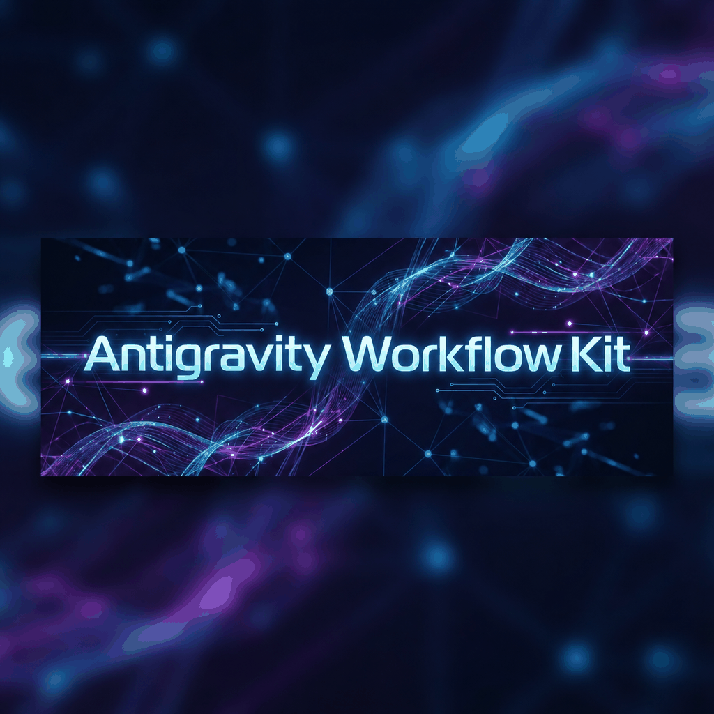

<div align="center">
  

  # Antigravity Workflow Kit

  **Transform Antigravity into a fully autonomous AI development environment.**

  Stop clicking "Accept" – let AI code for you while you focus on what matters.

  [](https://open-vsx.org/extension/ai-dev-2024/antigravity-workflow-kit)
  [](https://github.com/ai-dev-2024/antigravity-workflow-kit/stargazers)
  [](LICENSE)

  [Features](#features) • [Installation](#installation) • [Usage](#usage) • [Configuration](#configuration) • [Support](#support)
</div>

---

## 🚀 Overview

Antigravity Workflow Kit connects directly to the Antigravity editor's internal systems, unlocking true autonomy. By bridging the gap between the editor's capabilities and AI models, Workflow Kit enables features like **Auto-All** (zero-click acceptance), **Multi-Tab** (parallel workflows), and the **Autonomous Loop** for self-directed development.

### 🔗 Install Now

| Platform | Link |
|----------|------|
| **Open VSX** | [Install from Open VSX](https://open-vsx.org/extension/ai-dev-2024/antigravity-workflow-kit) |
| **GitHub Releases** | [Download VSIX](https://github.com/ai-dev-2024/antigravity-workflow-kit/releases) |

---

## ✨ Features

### 🚀 Auto-All Mode
**Zero-friction development.** Automatically accepts file edits, terminal commands, and prompts via deep CDP integration.
- ✅ Works reliably across Antigravity
- 🛡️ Banned command filtering for safety
- ⚡ Background operation with web workers

### 📑 Multi-Tab Mode
**Parallelize your productivity.** Work across all conversation tabs simultaneously.
- 🔄 Automatic tab rotation
- 📊 Progress tracking per conversation
- 🖥️ Visual overlay in background mode

### ⚡ AI Autonomous Mode
**The future of AI coding.** Continuous AI development loop with intelligent model selection.
- 🤖 **Reasoning** with Claude Opus 4.5
- 🎨 **Frontend** with Gemini 3 Pro
- ⚡ **Speed** with Gemini 3 Flash
- 🛑 Circuit breaker & recovery strategies

### 🆕 v3.0 Features

#### 🔌 MCP Server Integration
- 10 AI-callable tools for file ops, terminal, git, and diagnostics
- Model Context Protocol for seamless AI tool communication

#### 🧠 Persistent Session Memory
- Context tracking across sessions
- Semantic search and automatic summarization

#### 🔍 AI Code Review
- 15+ security patterns (SQL injection, XSS, hardcoded secrets)
- VS Code diagnostics integration

#### 📋 Project Management
- Jira & GitHub Issues sync
- @fix_plan.md automation

#### 🎤 Voice Control
- Natural language commands
- VS Code Speech API integration

#### 🤖 Multi-Agent Orchestration
- 5 specialized agents (Researcher, Implementer, Reviewer, Tester, Planner)
- Parallel task execution

#### 🧪 Autonomous Test Generator
- Vitest, Jest, Mocha support
- Edge case detection

#### 🔧 Custom Model Providers
- BYOM: Anthropic, Google, OpenAI, Ollama
- Cost tracking per model

#### 📢 Smart Notifications
- Slack, Discord, webhook integrations
- Daily summaries

### 📊 Settings Dashboard
**Full control.** Visual configuration panel to toggle features, set model preferences, and view session stats.

#### 🚀 Enable All Button (New!)
- **One-click activation** of all 12 features
- Enable All / Disable All buttons at the top of Features section
- Auto-saves each toggle immediately

---

## 📦 Installation

### From Open VSX (Recommended)
Search for **"Antigravity Workflow Kit"** in Antigravity Extensions, or [click here to install](https://open-vsx.org/extension/ai-dev-2024/antigravity-workflow-kit).

### From VSIX
1. Download the latest `.vsix` from [Releases](https://github.com/ai-dev-2024/antigravity-workflow-kit/releases)
2. In Antigravity: `Cmd/Ctrl+Shift+P` → "Extensions: Install from VSIX..."
3. Select the downloaded file

### From Source
```bash
git clone https://github.com/ai-dev-2024/antigravity-workflow-kit.git
cd antigravity-workflow-kit
npm install
npm run compile
npm run package
```


---

## 🎮 Usage

### Status Bar
Click the status bar items to toggle features instantly:
- **Auto-All**: Toggle auto-accept (✅ Ready)
- **Multi-Tab**: Toggle parallel mode (✅ Ready)
- **Workflow Kit**: Start autonomous loop (🚧 Beta)
- **⚙️**: Open Dashboard

### Dashboard
Access via `Workflow Kit: Open Dashboard` in the Command Palette.
- Configure feature toggles and model preferences
- View real-time session statistics
- Manage banned commands

### New Commands
- `Workflow Kit: Toggle MCP Server` — Enable MCP tools for AI
- `Workflow Kit: Toggle Voice Control` — Voice command support
- `Workflow Kit: Generate Tests` — Auto-generate tests for current file
- `Workflow Kit: Run Code Review` — Security & quality scan
- `Workflow Kit: Start Multi-Agent Task` — Parallel agent collaboration
- `Workflow Kit: Show Session Memory` — View memory context
- `Workflow Kit: Sync Project Tasks` — Jira/GitHub sync

---

## 🏗️ Architecture

```
src/
├── core/               # Business logic
│   ├── autonomous-loop.ts    # Main autonomous loop
│   ├── circuit-breaker.ts    # Safety mechanism
│   ├── model-selector.ts     # Intelligent routing
│   ├── task-analyzer.ts      # Context awareness
│   ├── memory-manager.ts     # 🆕 Session memory
│   ├── code-reviewer.ts      # 🆕 Security scanner
│   ├── agent-orchestrator.ts # 🆕 Multi-agent system
│   ├── test-generator.ts     # 🆕 Auto test gen
│   └── notification-manager.ts # 🆕 Smart alerts
├── providers/          # External integrations
│   ├── cdp-client.ts         # Chrome DevTools Protocol
│   ├── antigravity-usage.ts  # Usage scraping
│   ├── mcp-server.ts         # 🆕 MCP integration
│   ├── project-manager.ts    # 🆕 Jira/GitHub
│   └── model-provider.ts     # 🆕 BYOM support
├── ui/                 # User interface
│   ├── dashboard.ts          # Webview panels
│   ├── status-bar.ts         # Status bar controls
│   └── voice-controller.ts   # 🆕 Voice commands
└── main_scripts/       # Injection scripts
    ├── cdp-handler.js        # Core auto-accept logic
    └── full_cdp_script.js    # Browser injection
```

---

## ⚙️ Configuration

| Setting | Default | Description |
|---------|---------|-------------|
| `workflowKit.autoAllEnabled` | `false` | Enable Auto-accept mode |
| `workflowKit.multiTabEnabled` | `false` | Enable Multi-tab background work |
| `workflowKit.autopilotModeEnabled` | `false` | Enable Autonomous loop |
| `workflowKit.preferredModelForReasoning` | `claude-opus-4.5` | Model for complex logic |
| `workflowKit.preferredModelForFrontend` | `gemini-3-pro` | Model for UI/CSS tasks |

---


## 🤝 Contributing

We welcome contributions! Please fork the repository and submit a Pull Request.

1. Fork the Project
2. Create your Feature Branch
3. Commit your Changes
4. Push to the Branch
5. Open a Pull Request

---

## 📄 License

Distributed under the MIT License. See [LICENSE](LICENSE) for more information.

---

<div align="center">
  <h3>💖 Support the Project</h3>
  <p>If Workflow Kit saves you time, consider buying us a coffee.</p>
  <a href="https://ko-fi.com/ai_dev_2024">
    
  </a>
</div>
